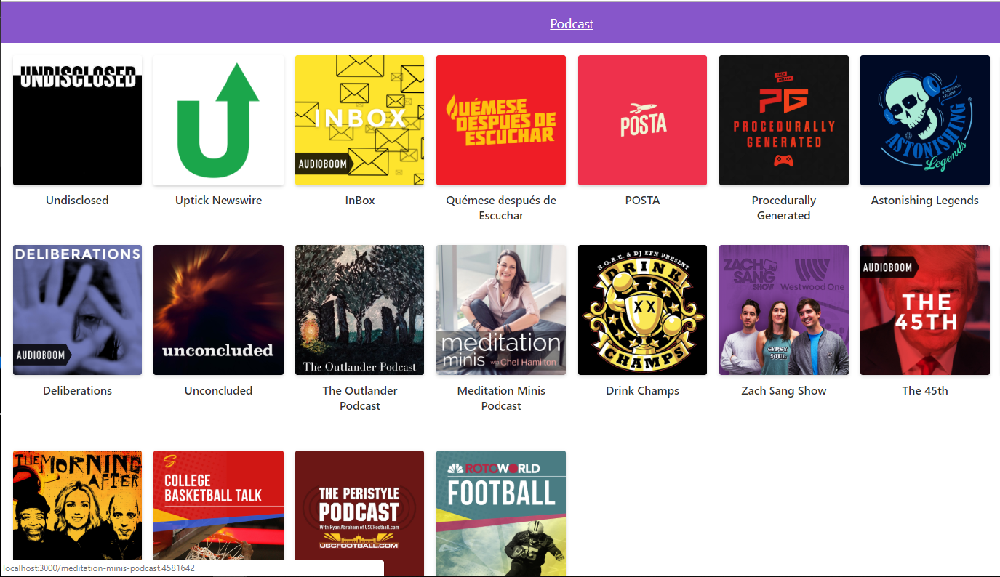

# App de Podcast, del curso de Next.js

Esta es una app de Podcast integrada con la API de AudioBoom
para aprender NEXT.JS

## ¿Cómo funciona?

Require Node.js 10

* `npm install` para installar dependencias
* `npm run dev` para el entorno de desarrollo
* `npm run build && npm start` para el entorno de producción

## Licencia

MIT